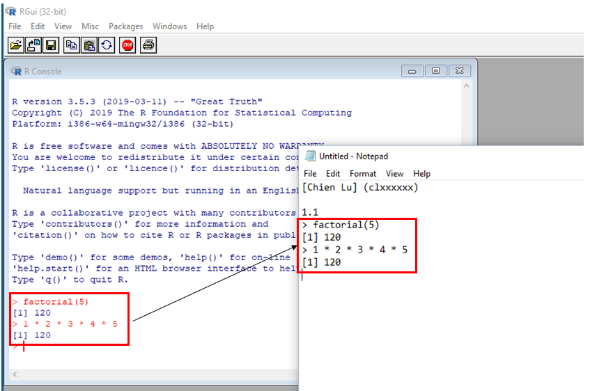

```{r setup, include=FALSE}
knitr::opts_chunk$set(comment = "#>", collapse = TRUE)
```

Example

* 1.1 Verify the function `factorial`


Steps

* the .txt file should contain your name and student number

* note the number of the problem (in this case, 1.1)

* copy-paste your code and output from the console to the .txt file

<center>
{width=500px}
</center>

<br>

* write descriptions if necessary

* save and send the file to chien.lu@tuni.fi