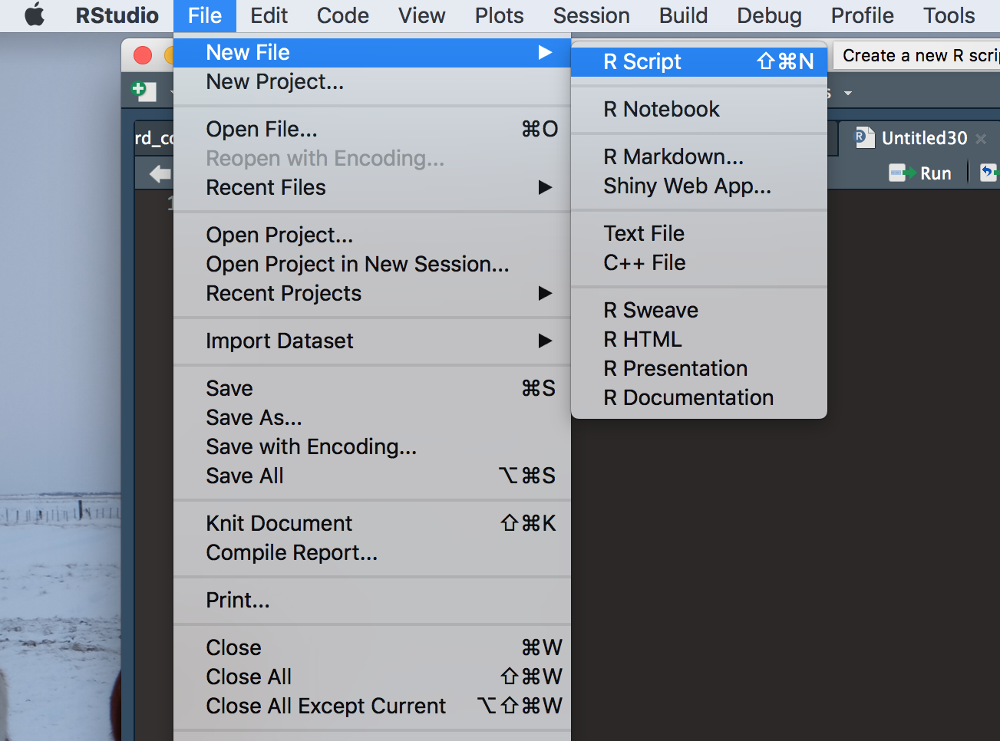
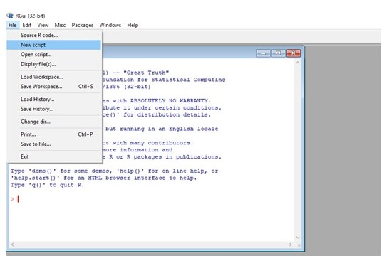
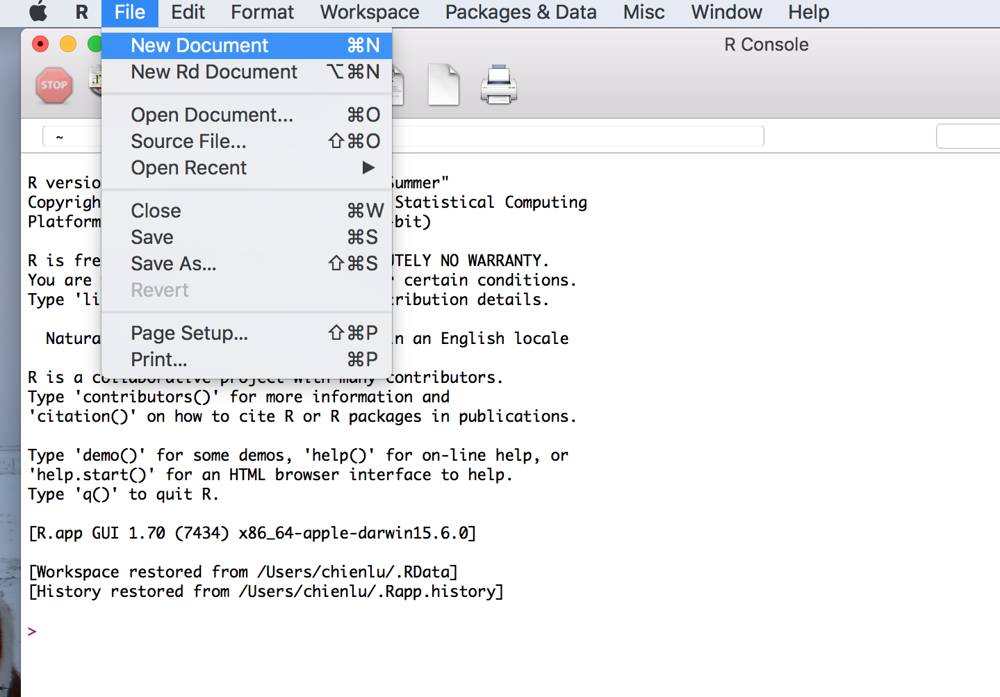

```{r setup, include=FALSE}
knitr::opts_chunk$set(comment = "#>", collapse = TRUE)
```

## 0. Getting Started!

## Why Learn R?

* Free (impotrant)
* Massive statistical packages
* More and more popular in both academia and industry
* _... Millions of  other reasons_

## How to access

* Download R from [CRAN](https://cran.r-project.org/mirrors.html)
* You can also download an useful GUI called [RStudio](https://www.rstudio.com/products/rstudio/)


### RStudio
Create a script by clicking _File_ >> _New File_ >> _R Script_

To execute your code, highlight the code you wish to execute and press _Ctrl + Enter_

{width=500px}
<br>

### RGui (Windows)
Create a script by clicking _File_ >> _New Script_

To execute your code, highlight the code you wish to execute and press _F5_

{width=500px}

<br>

### RGui (Mac OS)
Create a script by clicking _File_ >> _New Document_

To execute your code, highlight the code you wish to execute and press _Ctrl + Enter_

{width=500px}

<br>

### Set up the working directory

```{r, eval=FALSE}
getwd()
```

List all the files/folders under the current working directory

```{r, eval=FALSE}
dir()
```

Change the working directory (mind the `/`)

```{r, eval=FALSE}
setwd("/Users/chienlu/Desktop")
```

### Quit the R session

```{r, eval=FALSE}
q()
```

### Some Useful tips

* You can use `#` to add comment, the code after will not be executed.

```{r}
a<- c(1, 2, 3) #I have no idea why I created this vector
```

* Use `?` to call R help when you have difficulties.

```{r}
?dir
```

* When encountering problems, always _Google_!

### *Exercise Pack 0*
1. Check your current directory with the function `getwd`.
2. Change your working directory to your desktop and list all the file/folders

## 1. R as Calculator

You can start with playing around with R, use it as a calculator

```{r}
1 + 3
6*(5-1)
```

Some useful operators:

* `+`: addition
* `-`: subtraction
* `*`: multiplication
* `/`: division
* `x %% y`: modulus (Remainder from division)
* `x %/% y`: integer division
* `^ or **`: exponentiation, e.g. `3^2` or `3**2` to compute $3^2$ 

__?__ What is the output of the following code?

* `-1^2` = ?
* `(-1)^2` = ?

You can also try out some more complicated (fancier) computations, such as Trigonometric functions (high school nightmare):

* `sin()`: sine 
* `cos()`: cosine
* `tan()`: tangent
* `exp()`: Exponential with base _e_
* `log()`: Logarithm
* `log10()`: Logarithm with the base 10
* `sqrt()`: Square root
* `abs()`: Absolute value
* `round()`: Round the value
* `floor()`: Round down the value
* `ceiling()`: Round up the value
* `factorial()`: Factorial function
* `gamma()`: Gamma function
* `digamma()`: Digamma function
* ...

__?__ What are the solutions to the following equations

* sin($\frac{\pi}{2}$) = ?
* cos($\pi$) = ?
* tan($\frac{\pi}{4}$) = ?

__?__ Can you verify if the function `factorial` returns the correct result of $5!$?
```{r}
5*4*3*2*1
factorial(5)
```

### *Exercise Pack 1*
1. Calculate the volume of a sphere (ball) whose raduis $r = 2$
2. What is $35^\circ C$ in Fahrenheit ($^\circ F$)?
3. Use 5 different $\theta$ values to calculate the result of $sin(\theta)^2 + cos(\theta)^2$
4. In a right triangle with sides $a = b = 2 < c$, how long is $c$? (Use Pythagorean Theorem)

## 2. Basic R Objects

### Declare value

Use `<-` to declare a value to an object.
```{r}
x<- 1
x
```

of course, using `=` to assign the value also works.
```{r}
x = 1
x
```

Use `class`, `mode` or `typeof` to check the type of the object.
```{r}
x<- 1.1
class(x)
mode(x)
typeof(x)
```

### Working environment
List all the objects under the current working environment.
```{r, eval=FALSE}
ls()
```

* `rm()` remove object
* `object.size()` memory used by the object

Remove all the objects under the current working environment.
```{r, eval=FALSE}
rm(list = ls())
```

### Numbers

Numeric (real number)
```{r}
x<- 0.8
class(x)
```
Complex number
```{r}
x<- 3+0i            	
class(x)
```

Scientific notation
```{r}
x<- 9.6e-4            
```

Infinity (use `is.infinite` or `is.finite` to test)
```{r}
x<- 1/0
x

is.infinite(x)
is.finite(x)
```

Not a number (undefined result, use `is.nan` to test)
```{r}
x<- 0/0
x
is.nan(x)
```

Null object (use `is.null` to test)
```{r}
x<- NULL
is.null(x)
```

Not available/missing value (use `is.na` to test)
```{r}
x<- NA
is.na(x)
is.nan(x)
```

Use `identical` to check if two objects are identical
```{r}
x<- 1e-3
y<- 0.001
identical(x, y)
```

### Logical
```{r}
x<- TRUE
x

y<- FALSE
y
```

or

```{r}
x<- T
x

y<- F
y
```

Some logical operators

* `!`: not
* `==`: exactly equal to
* `!=`: not equal to
* `&`: and
* `|`: or
* `<`: less than
* `<=`: less than or equal to
* `>`: greater than
* `>=`: greater than or equal to

* __?__ `!!!T | !F` = ?
* __?__ `T > F` = ?
* __?__ `T + F` = ?

### Strings
```{r}
a <- "hello"
a
class(a)
print("Hello R!")

```

### Functions

Define your own function with `function`.

```{r}
my_square<- function(x){
  x^2
}

my_square(4)
```

or

```{r}
my_plus<- function(x, y){
  x + y
}

my_plus(2, 3)
```

Note that the last element in the function will be returned as the output value. Or you can use `return` to specify your output value.

```{r}
my_square<- function(x){
  return(x^2)
  x^3 # does not affect the output
}

my_square(4)
```

### *Exercise Pack 2*
1. Check `identical(as.integer(5), 5.0)` and `as.integer(5.0) == 5`, which one is TRUE?
2. List all object under the current environment. Check the memory used by the first object in the list.
3. Check the types of the following objects (choose one from `class`, `typeof`, and `mode`)
+ `Inf - Inf`
+ `Inf + Inf`
+ `0/0`
+ `sin(Inf)`
+ `Inf/0`
4. Complete the following function to compute the area of an ellipse where `a` and `b` are the axes.

```{r, eval=F}
ellipse_area<- function(a, b){
  
}

ellipse_area(3, 5)
```

## 3. Data structures

### Vectors

All the elements in a vector should be of the same object type. 

Use `c` to create a *vector*
```{r}
## number
exp_1<- c(1, 2, 3, 4, 5)
exp_1

## logical
exp_2<- c(TRUE, FALSE, FALSE, TRUE)
exp_2

## string
exp_3<- c("I", "am", "a", "meaningless", "example")
exp_3
```

or use `vector` to define an empty vector
```{r}
emp_vec<- vector()
emp_vec
```

Use `seq` to create a vector with sequential numbers
```{r}
a<- seq(from = 1, to = 5, by = 1)
a
```

or just simply:
```{r}
a<- 1:5
a
```

Use `rep` to create a vector with replicate elements
```
b<- rep(x = 1, times = 3)
b
```

Use `sample` to create a vector with random numbers

```{r}
s<- sample(x = 1:100, size = 5)
s
```

Set the seed with `set.seed` function before sampling if you want to reproduce the result.

```{r}
sample(1:100, 5)
sample(1:100, 5)

set.seed(123)
sample(1:100, 5)

set.seed(123)
sample(1:100, 5)
```


* `min()` and `max()`: minimum value and maximum value within a vector
* `which.min()` and `which.max()`: index of the minimal element and maximal
element of a vector
* `pmin()` and `pmax()`: element-wise minima and maxima of several vectors
* `sum()` and `prod()`: sum and product of the elements of a vector
* `cumsum()` and `cumprod()`: cumulative sum and product of the elements of a
vector

```{r}
s<- sample(1:100, 5)
s

min(s)
max(s)
which.min(s)
which.max(s)
```

Concatenate vectors
```{r}
vec_1<- c(1, 1, 1)
vec_2<- c(2, 2, 2)
vec_join<- c(vec_1, vec_2)
vec_join

vec_3<- c(3, 3, 3)
vec_join<- c(vec_1, vec_2, vec_3)
vec_join
```

Subset a vector
```{r}
a<- c(1, 2, 3, 4, 5)

# extract with indices
a[c(1, 3, 5)]

# extract with logicals
a[c(T, F, T, F, T)]

a %% 2 == 1

a[(a %% 2 == 1)]

# omit
a[-c(2, 4)]

a[-which(a %% 2 == 0)]

```

`NA` values in a vector
```{r}
a<- c(1, NA, 2, NA, 3)
a

b<- c(1, 2, 3, 4, 5)
b * c(1, NA, 1, NA, 1)

# replace NA with 0
a[is.na(a)]<- 0
a
```

Vectorized computation

```{r}
a<- c(1, 2, 3, 4)
b<- c(5, 6, 7, 8)

a + b
a * b
```

* __?__ `a = c(1, 2, 3, 4)` and `b = c(1, 2, 3)` What is the value of `a*b`?


### Factors
Represente categorical data with specifying levels (e.g. gender, education). A factor is stored as a vector of integers with corresponding labels.

```{r}
x<- c("Python user", "R user", "C++ user", "R user", "C++ user", "JAVA user", "R user")
f_x<- factor(x)
f_x
levels(f_x)
nlevels(f_x)
class(f_x)
summary(f_x)
```

or assign the labels you prefer

```{r}
x<- c(1, 2, 1, 2, 1, 1, 1)
f_x<- factor(x, labels = c("male", "female"))
f_x
summary(f_x)
```

or by spliting a vector into groups with the function `cut`

```{r}
x<- c(12, 64, 47, 36, 31, 64, 25, 34,  6, 89)
f_x<- cut(x, c(0, 14, 64, 100))
f_x

levels(f_x)<- c("child", "labor", "aged")
summary(f_x)
```

### Matrices
Define a matrix
```{r}
x<- matrix(1:15, nrow = 3, ncol = 5, byrow = F)
x

x<- matrix(1:15, nrow = 3, ncol = 5, byrow = T)
x
```

Subset a matrix
```{r}
x<- matrix(1:15, nrow = 3, ncol = 5)
x[2,]
x[,1]
x[2,1:3]
x[1:2,c(1,3)]
```

Some useful functions and operators for matrix computations:

* `%*%`: matrix multiplication
* `%o%`: outer product
* `crossprod()`: cross product
* `t()`: tranpose matrix
* `diag()`: diagnal
* `det()`: calculate the determinant of the matrix
* `solve()`: obtain the inverse matrix

```{r}
A<- matrix(sample(1:10, 4), 2, 2)
B<- matrix(sample(1:10, 6), 2, 3)
A
B
A%*%B
t(A) %*% A
crossprod(A)
solve(A)
```

### Arrays
Define an array
```{r}
x<- array(1:24, dim = c(4, 3, 2))
x

x[3,,]
x[3,2,]
x[3,2,1]
```

### Lists
```{r}
x<- list(name = "miina", age = 25, score = 1, pass = T, gender = "female")
length(x)
x$name
x[2]
x[[3]]
x["pass"]
x[["gender"]]
```

### Data Frames
A data frame generalized matrix in which each column may have different object types. It can be also seen as aa list of colume vectors with all equal length, thus, the way to extract the colums is the same as how you do on a list.
```{r}
toy_dat<- data.frame(id = 1:5, age = c(15, 5, 11, 10, 95), city = c("Tampere", "Pori", "Tampere", "Helsinki", "Turku"))
toy_dat
toy_dat$id
toy_dat[2]
```

Import and Export Dataset

The example dataset steam_subset.csv can be found [here](https://raw.githubusercontent.com/HumbleLu/IntroR/master/steam_subset.csv). (Right click -> Save as). The colums are seperated with comma( , ) and the first line is the column names.

Read the data set from a file with `read.table`, use functions `head` and `str` to check the dataset

```{r}
steam<- read.table(file = "steam_subset.csv", sep = ",", header = T)
head(steam)
str(steam)
```

or use `read.csv` to read the file

```{r}
steam<- read.csv(file = "steam_subset.csv", header = T, sep = ",")
head(steam)
str(steam)
```

Computation on the variables
```{r}
mean(steam$Level)
sd(steam$Level)
```

Attach a dataset
```{r}
# stick to it
attach(steam)
mean(Level)
sd(Level)

# get rid of it
detach(steam)
```

Save the dataset to a csv file
```{r, eval = F}
write.csv(toy_dat, file = "toy.csv", row.names = F)
```

### *Exercise Pack 3*
1. Create a vector `z` of length 10 with variance equals to 0 and mean equals to 5. Verify with function `mean` and `var`.
2. Create a function which returns the sum of the maximum and the mininum value of the input vector
3. Create a function which approximates the sin function with 4th-order taylor series. 
4. Compute the CV (coefficient of variation) values of variables `Levels` and `Badges` in the `steam` dataset.
5. Create a toy data frame object with at least 5 rows and 3 columns, save it to a .csv file.

## 4. Computations

### Loops

For loop
```{r}
for(i in c(1, 3, 5)){
  print(i)
}
```

or

```{r}
for(i in seq(1, 5, 2)){
  print(i)
}
```

While loop
```{r}
i<- 1
while(i <= 5){
  print(i)
  i<- i + 2
}
```

### Conditional statement
`if` statement
```{r}
x<- 2
if(x > 0){
print("Positive number")
}
```

`if` ... `else` statement
```{r}
x<- -1
if(x > 0){
print("Positive number")
} else {
print("Not a positive number")
}
```

or

```{r}
ifelse(test = x>0, yes = "Positive number", no = "Not a positive number")
```

`if` ... `else` ladder
```{r}
x<- 0
if(x > 0){
print("Positive number")
} else if(x < 0){
print("Negative number")
} else{
  print("Zero")
}
```

### More Functions

You can set up a default input
```{r}
hello<- function(obj = "R"){
  print(paste("Hello", obj, "!"))
}

hello()
hello("World")
```

A function can also generate a function. For example, the volume of a $d$-dimensional hypersphere with radius $r$ is $\frac{\pi^{\frac{d}{2}}}{\Gamma(\frac{d}{2} + 1)} r^d$.

```{r}
hypersphere<- function(d){
  function(r){
    (pi^(d/2)/gamma(d/2 + 1)) * (r^d)
  } 
}
```

A circle is a 2-dimensional case:
```{r}
circle<- hypersphere(2)
circle(1)
```

A ball is a 3-dimensional case:
```{r}
ball<- hypersphere(3)
ball(1)
```

or

```{r}
hypersphere(2)(1)
hypersphere(3)(1)
```

Operators are also functions

```{r}
1 + 1
"+"(1,1)
```

__?__ What is the output of `"**"(1, 2)` ?

You can also define your operator with `%`

```{r}
"%negative prod%"<- function(a, b){
  a * b * (-1)
}

2 %negative prod% 3
```

### Apply functions

`apply` takes a matrix, the MARGIN detering the row-wise (`1`) or column-wise (`2`)  computation.
```{r}
a<- matrix(1:6, 2, 3)
a
apply(a, 1, sum)
apply(a, 2, sum)
```

`lapply` takes a list or a vector, returns a list.
```{r}
lapply(c(1, 2, 3, 4), function(x) x + 1)
```

`lapply` takes a list or a vector, returns a vector
```{r}
sapply(c(1, 2, 3, 4), function(x) x + 1)
```

### *Exercise Pack 4*
1. Use conditional statement to complete the following greeting function. The function prints `"good morning"`, `"good afternoon"`, `"good evening"` or `"good night"` according to the current hour.

```{r, eval=F}
greeting<- function(hour = lubridate::hour(Sys.time())){
  
}

greeting()
```

Note. `lubridate::hour(Sys.time())` returns the current hour (0-24). If the package `lubridate` is not installed, use:

```{r, eval=F}
greeting<- function(hour = as.numeric(format(strptime(Sys.time(), "%Y-%m-%d %H:%M:%S") , "%H"))){
  
}

greeting()
```

2. Write a for loop to sum up all the elements of a vector, compare time consumption with simply using the function `sum`. Use the function `Sys.time()` to record the time, for example:
```{r, eval=F}
start_t<- Sys.time()

#computation

end_t<- Sys.time()
end_t - start_t
```

3. Write a loop to print out all the prime numbers smaller than 50.
4. Make an operator `%$>€%` to detect if the amount of money of the left hand side is greater than the right hand side. Where the left hand side is holding US dollars (\$) and the right hand side is holding Euros (€). The exchange rate is 1€ = 1.1\$.
5. Use `apply` to compute the coefficient of variation (CV) of each column in the steam dataset.
6. Use `sapply` to calcluate the object size of all the objects under current environment. Hint: you will need functions `ls()` and `object.size()`.